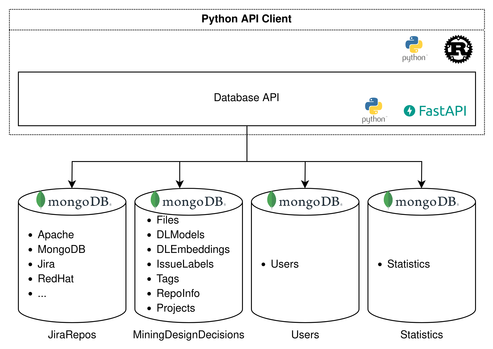

# Maestro -- Data Access API & Database Architecture

## High-level Architecture
On a high level, the architecture consists of two components. The first component consists of the databases and the
second component is the database API. Additionally, we have created a Python API Client for easier interaction with
the database API from a Python environment.


*High level overview of the architecture. It contains the technologies used for each component. The two main components
are the database API and the databases. In total there are 4 databases, and each of them has one or more collections.
The database API is an abstraction and security layer on top of the databases. Additionally, we have written a Python
API client to allow for easier interaction with the database API from a Python script.*

### Databases
The databases contain all data related to the deep learning models, annotated issues, and issue data. The data is stored
in four separate databases.

The first database (JiraRepos) contains the issue data that is pulled
from the Jira API. This database is an updated version of \cite{montgomery_alternative_2022} and can be downloaded here
(https://zenodo.org/record/8225601 -> mongodump-JiraRepos_2023-03-07-16 00.archive). It contains issues from many
projects from different ecosystems. Our system does not modify this database, except when the issue data is updated.
This database is in practice therefore a read-only database.

The second database (MiningDesignDecisions) contains the deep learning related data, and the annotated issues.

The third database (Users) contains user information that is used for authentication to the API.

The fourth database (Statistics) is basically a cache for the calculated statistics on the issues in our database.

### Database API
The database API provides an abstraction and security layer for accessing the database. Each endpoint fulfills simple
queries to the database, and therefore its architecture is quite shallow. Documentation for this API is automatically
generated by FastAPI, and can be found at `https://{URL}:8000/docs`, where `{URL}` is the url to access the API (
probably `localhost` when running it on a local machine).

## Technology Stack
The technologies we used are listed below:
- MongoDB is used for the database
- Python is used to program the API
- PyMongo is used to interact with the database from the Python API
- FastAPI is used for the API functionality
- Rust is used to program the Python database API
- Docker is used to run the database, database API, and backup tool in containers

## Collections and Schemas
The most interesting, and less straight-forward, parts of Maestro are the collections in the databases.
These use fixed schemas, which will be described in this section.

### JiraRepos
The JiraRepos database contains numerous collections. Each collection represents an ecosystem, e.g. Apache, MongoDB,
etc. None of these collections has a fixed scheme. The data inside these collections is basically the raw JSON data
that is returned by the Jira API.

### MiningDesignDecisions
The MiningDesignDecisions database contains many schemas related to deep learning data and annotated issues.

#### Files
Certain entities require a regular file storage. We use GridFS for this. Because this file storage is used by other
collections, we will start with this collection. When files are stored in GridFS, they receive a unique ObjectId. We
store this ObjectId in this collection as well. Additionally, files can have a description, to provide some metadata
about the file. Files can also belong to a category. Categories are managed by users and not by the system itself.
```
{
    "$jsonSchema": {
        "bsonType": "object",
        "additionalProperties": False,
        "properties": {
            "_id": {
                "bsonType": "objectId",
                "description": "'_id' must be a objectId. This is also used as the file id.",
            },
            "description": {
                "bsonType": "string",
                "description": "'description' must be a string",
            },
            "category": {
                "bsonType": "string",
                "description": "'category' must be a string",
            },
        },
    }
}
```

#### DLModels
The first collection is for storing the deep learning models. Specifically, we want to store a model name (for easy
reference), a model config (for setting the (hyper)parameters of a model), the model versions (for storing trained
versions of a model), and the model performances (for storing performance data, for example the F1-score, precision,
recall, etc. of a cross-validation run). A model can have many versions or performances. However, we decided to only
allow a single model config, because trained versions and performance metrics should belong to a single config.
Otherwise, it can become unclear what version is trained with what config, and also what performance data was obtained
with what config.

For each model, we store a unique ObjectID to make sure we can uniquely identify models. Models can also have a name
,and they should have a config. The model versions are stored as files, because these model versions are basically zip
files. Additionally, each version can be given a description. Each version is identified by its file-id. Storing the
performances is similar to this. This leads to the following schema for this collection:
```
{
    "$jsonSchema": {
        "bsonType": "object",
        "additionalProperties": False,
        "required": ["name", "config", "versions", "performances"],
        "properties": {
            "_id": {"bsonType": "objectId", "description": "'_id' must be a objectId"},
            "name": {"bsonType": "string", "description": "'name' must be a string"},
            "config": {
                "bsonType": "object",
                "description": "'config' must be an object",
            },
            "versions": {
                "bsonType": "object",
                "description": "'versions' must be an object",
                "additionalProperties": {
                    "bsonType": "object",
                    "required": ["description"],
                    "properties": {
                        "description": {
                            "bsonType": "string",
                            "description": "'description' must be a string",
                        }
                    },
                },
            },
            "performances": {
                "bsonType": "object",
                "description": "'performances' must be an object",
                "additionalProperties": {
                    "bsonType": "object",
                    "required": ["description"],
                    "properties": {
                        "description": {
                            "bsonType": "string",
                            "description": "'description' must be a string",
                        }
                    },
                },
            },
        },
    }
}
```

#### DLEmbeddings
Embeddings store the input encodings for a model. For example, it can store the vectors of each word for Word2Vec.
We have created a dedicated collection for embeddings, because many models can use the same embedding. Storing these
embeddings is rather simple. An embedding has a unique ObjectId to uniquely identify an embedding. An embedding can have
a name, to make it easier to identify an embedding. Similar to deep learning models, embeddings are trained with a
certain config, which we also store. Lastly, the embedding is being saved as a file, so we need to store the file-id
of the file that stores the embedding. This yields the following schema:
```
{
    "$jsonSchema": {
        "bsonType": "object",
        "additionalProperties": False,
        "properties": {
            "_id": {"bsonType": "objectId", "description": "'_id' must be a objectId"},
            "name": {"bsonType": "string", "description": "'name' must be a string"},
            "config": {
                "bsonType": "object",
                "description": "'config' must be an object",
            },
            "file_id": {
                "bsonType": ["objectId", "null"],
                "description": "'type' must be an objectId",
            },
        },
    }
}
```

#### IssueLabels
The IssueLabels collection is mainly focused on storing the labels of annotated issues. We therefore store the id that
uniquely identifies an issues (note that this is different from an issue key). This id is a concatenation of the
ecosystem (e.g. Apache) and the id given to that issues by the issue tracker of that ecosystem, e.g. an id can look like
'Apache-42'. Issue labels are stored using three different boolean fields: existence, executive, and property. They
represent one of the architectural subtypes each. Additionally, we can add tags to issues. For example, we can add tags
for the method used to find the issue, or who annotated the issue, etc. Furthermore, annotators can comment on issues.
Therefore, for each comment, we store who posted the comment (i.e. author) and what the annotator commented (i.e.
comment).

Due to the lack of efficient join operations in MongoDB, we have to store the predictions of models in this collection
as well. Predictions belong to a specific version of a model, and are therefore identified by a concatenation of the
model-id and version-id, i.e. '{model-id}-{version-id}'. If an issue has a prediction from such a model-version, the
predictions object has an entry for each of the predicted classes (e.g. existence, executive, or property, but
'architectural' is also possible). This entry consists of the confidence of the classifier and the actual prediction.
This leads to the following schema:
```
{
    "$jsonSchema": {
        "bsonType": "object",
        "additionalProperties": False,
        "properties": {
            "_id": {"bsonType": "string", "description": "'_id' must be a string"},
            "existence": {
                "bsonType": ["bool", "null"],
                "description": "'existence' must be a boolean",
            },
            "property": {
                "bsonType": ["bool", "null"],
                "description": "'property' must be a boolean",
            },
            "executive": {
                "bsonType": ["bool", "null"],
                "description": "'executive' must be a boolean",
            },
            "tags": {
                "bsonType": "array",
                "description": "'tags' must be an array of strings",
                "uniqueItems": True,
                "items": {
                    "bsonType": "string",
                    "description": "a 'tag' must be a string",
                },
            },
            "comments": {
                "bsonType": "object",
                "additionalProperties": {
                    "bsonType": "object",
                    "additionalProperties": False,
                    "required": ["author", "comment"],
                    "properties": {
                        "author": {
                            "bsonType": "string",
                            "description": "'author' must be a string",
                        },
                        "comment": {
                            "bsonType": "string",
                            "description": "'comment' must be a string",
                        },
                    },
                },
            },
            "predictions": {
                "bsonType": "object",
                "additionalProperties": {
                    "bsonType": "object",
                    "additionalProperties": {
                        "bsonType": "object",
                        "required": ["prediction", "confidence"],
                        "properties": {
                            "prediction": {
                                "bsonType": "bool",
                                "description": "'prediction' must be a bool",
                            },
                            "confidence": {
                                "bsonType": "double",
                                "description": "'confidence' must be a double",
                            },
                        },
                    },
                },
            },
        },
    }
}
```

#### Tags
As explained, tags are used as extra information for issues. To keep track of what tags are in the database, we use
the Tags collection. First, we use the tag itself to uniquely identify the tag. Second, we can provide a description
of what the tag means. And third, we store the type of the tag. Some tags are created by the user and are of the type
'manual-tag'. However, many tags are created by the system to allow for filtering issues. For example, issues from
Apache Cassandra are tagged with 'Apache-CASSANDRA'. These tags are of the type 'project'. The following schema is used
to store this information:
```
{
    "$jsonSchema": {
        "bsonType": "object",
        "additionalProperties": False,
        "properties": {
            "_id": {"bsonType": "string", "description": "'_id' must be a string"},
            "description": {
                "bsonType": "string",
                "description": "'description' must be a string",
            },
            "type": {"bsonType": "string", "description": "'type' must be a string"},
        },
    }
}
```

#### RepoInfo
The initial script of \cite{montgomery_alternative_2022} did not provide a way to update the database. We extended
that script and incorporated it in Maestro. For each repository, we have to keep track of certain data. First, we
have to store the repository URL to be able to download issues from the repository. We also store the date we last
updated the issues. For the download process, we have to specify a batch size (how many issues are pulled at once from
the Jira API) and the query wait time in minutes (required for repositories that are rate-limited). Lastly, we store
the issue link prefix, which can be used in combination with an issue key to link to the Jira page of an issues. This
yields the following schema:
```
{
    "$jsonSchema": {
        "bsonType": "object",
        "additionalProperties": False,
        "properties": {
            "_id": {"bsonType": "string", "description": "'_id' must be a string"},
            "repo_url": {
                "bsonType": "string",
                "description": "'repo_url' must be a string",
            },
            "download_date": {
                "bsonType": ["string", "null"],
                "description": "'download_date' must be a string",
            },
            "batch_size": {
                "bsonType": "int",
                "description": "'batch_size' must be an int",
            },
            "query_wait_time_minutes": {
                "bsonType": "double",
                "description": "'query_wait_time_minutes' must be a double",
            },
            "issue_link_prefix": {
                "bsonType": "string",
                "description": "'issue_link_prefix' must be a string",
            },
        },
    }
}
```

#### Projects
We use the Projects collection to keep track of what projects are in our database. Each project has a key (e.g.
CASSANDRA) and belongs to a certain ecosystem. We use a concatenation of the two (ECOSYSTEM-KEY) to uniquely identify
a project. Additionally, for our research we needed to store what projects belong to certain software domains. We can
use the additional_properties for that. This results in the following schema:
```
{
    "$jsonSchema": {
        "bsonType": "object",
        "additionalProperties": False,
        "required": ["ecosystem", "key", "additional_properties"],
        "properties": {
            "_id": {"bsonType": "string", "description": "'_id' must be a string"},
            "ecosystem": {
                "bsonType": "string",
                "description": "'ecosystem' must be a string",
            },
            "key": {"bsonType": "string", "description": "'key' must be a string"},
            "additional_properties": {
                "bsonType": "object",
                "additionalProperties": True,
                "description": "'additional_properties' must be an object",
            },
        },
    }
}
```

### Users
The Users database only contains the Users collection. For each user, we store a unique id (i.e. the username) and the
hashed password. The schema is therefore rather simple:
```
{
    "$jsonSchema": {
        "bsonType": "object",
        "additionalProperties": False,
        "properties": {
            "_id": {"bsonType": "string", "description": "'_id' must be a string"},
            "hashed_password": {
                "bsonType": "string",
                "description": "'hashed_password' must be a string",
            },
        },
    }
}
```

### Statistics
The Statistics database also only contains a single collection, the Statistics collection. This collection functions
as a cache and does not have a fixed schema.

## Security
We have enabled authentication for endpoints that modify the database (i.e. non-GET requests). This security layer is
implemented using [JSON web tokens](https://fastapi.tiangolo.com/tutorial/security/oauth2-jwt/). To use such endpoints,
it is required to log in to the database API using a valid username and password, after which the JSON web tokens can
be used to use the endpoints.

## Backup Functionality
The backup tool is a simple script that dumps all the data from the MiningDesignDecisions database in an archive, which
can be uploaded to e.g. Google Drive. This tool can be extended to also make backups for e.g. the Users database, but
this was not necessary for our research. Furthermore, the script could be changed to upload to other storage locations.
This tool is completely external to the system and is therefore optional to use.