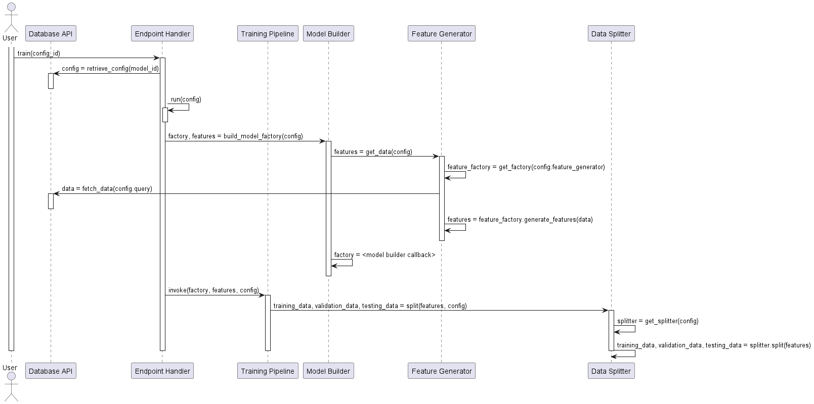

# Maestro -- Deep Learning Manager Architecture

---

## Introduction 

The deep learning manager is the largest component in Maestro, 
and it is one of the most complicated. 
Throughout its development, many changes have been made. 
This has resulted in a significant amount of technical debt. 
Changes to address this are planned in the Maestro roadmap.
However, there is no way to explain all detailed ins and outs 
regarding the architecture of the deep learning manager.
In stead, we will present the high level architecture.
This also corresponds to an idealised architecture of the system;
Ideally, the system will be refactored to adhere to the 
architecture explained here. However, currently, there are 
yet to be resolved coupling problems.
However, this architecture should also be accurate and comprehensive
enough for most practical applications.

---

## Training Sequence Diagram 

## Component Diagram 