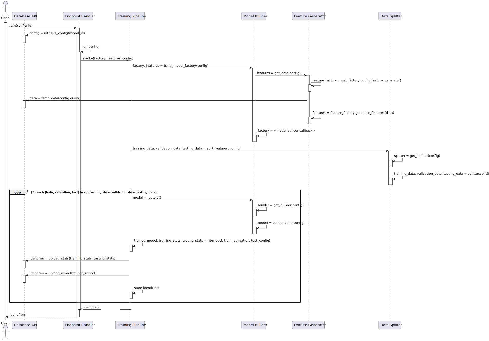

# Maestro -- Deep Learning Manager Architecture

---

## Introduction 

The deep learning manager is the largest component in Maestro, 
and it is one of the most complicated. 
Throughout its development, many changes have been made. 
This has resulted in a significant amount of technical debt. 
Changes to address this are planned in the Maestro roadmap.
However, there is no way to explain all detailed ins and outs 
regarding the architecture of the deep learning manager.
Instead, we will present the high level architecture.
This also corresponds to an idealised architecture of the system;
Ideally, the system will be refactored to adhere to the 
architecture explained here. However, currently, there are 
yet to be resolved coupling problems.
However, this architecture should also be accurate and comprehensive
enough for most practical applications.

---

## Logical View & Implementation View

The diagram below presents the logical view of the deep learning manager, 
as well as an overview of the implementation view.
The top part of the diagram depicts the logical view; 
the bottom part the implementation view.
The components and packages in the diagrams are colour-coded 
in order to show how the logical view can be mapped to the 
implementation view.
Files not colour-coded or not contained in a colour-coded 
folder are auxiliary files. We included arrows depicting how 
these auxiliary files are used by the other files in the system
which _can_ be mapped to the logical view.
Four files are not connected to any others. These are general 
purpose files which are used in many places throughout the code.

We will explain the logical view in a bit more detail,
and explain how the components interact together 
(which means we include some details on the processes going on). 
We use [`FastAPI`](https://fastapi.tiangolo.com/) in order to run 
the deep learning manager as a web server. The incoming requests 
are routed through the endpoint dispatcher. The endpoint 
dispatcher validates the inputs given by the user. 
If running in scripting mode 
(see [the usage documentation](../usage/dl_manager/index.md)),
this component is also responsible for checkpointing.
Next, the dispatcher invokes the appropriate pipeline.
When we call something a pipeline, we simply mean a piece of code 
which calls a number of other components in sequence in order 
to perform some task.

Every pipeline makes use of one or more components all structured
the same way. There are components for embedding generation,
feature generation, data splitting, upsampling, model building,
and metric computation. Every component has the same basic structure:
an abstract class defining an interface, and a number of concrete 
class providing the actual implementation which can be used by the
pipelines. The deep learning manager can be extended by adding 
new concrete implementations, and registering these in the 
`__init__.py` files of the respective components;
the rest of the system (including argument parsers) will be able to 
automatically detect and use these components based on the 
user inputs passed to the system. 
This functionality is what gives the deep learning manager 
its extensibility. 


## Process View 

There are five major public endpoints.
In this section, we will briefly describe how each functions. 
We start with the embedding generation, prediction, and metrics 
endpoints because these are similar and the easiest. 
We end with the training endpoint, because this one is considerably 
more complicated than the others.

### Embedding Generation

When generating an embedding 
using the `generate-embedding` endpoint,
the embedding pipeline is invoked.
The embedding pipeline downloads the config file containing 
the settings to generate the embedding with from the database API.
Next, an internal `generate-embedding-interal` endpoint is invoked
with as arguments 1) the arguments for the original 
`generate-embedding` endpoint, and 2) the values from the 
embedding config. The internal endpoint then selects 
a concrete embedding generator which generates the embedding,
and uploads the embedding to the database using the database API.

### Prediction 

When using the `predict` endpoint for prediction,
the deep learning manager invokes the prediction pipeline.
The pipeline then downloads the specified pretrained 
model using the database API, and unpacks all the information
stored inside. Next, it reads the feature generation 
data from the unpacked model, and invokes the feature generator
with the settings loaded from the stored model.
The feature generator downloads the issues specified by the 
user's query and generates the appropriate features.
Next, the features are returned to the pipeline, which
loads the actual trained model and uses it to compute
the predictions. The predictions are then stored in the 
database using the database API.

### Metric Calculation (metrics & confusion matrices)

There are two endpoints for computing metrics: `metrics` and `confusion-matrix`.
Both share the same pipeline. First, the pipeline downloads the predictions of the 
model on the training, validation, and test sets which were recorded during the 
training process. This data is then passed to the metric manager, which in turn
calls the concrete metrics to compute the actual metrics. These results are passed 
to the pipeline, which computes aggregate (averages) metrics in case of 
k-fold runs. The results are then returned in the response from the endpoint.

### Training 

The `train` endpoint is used for optimising, training, and evaluating models.
First, the training pipeline downloads the model config from the database API.
Next, an internal `run` endpoint is called with the data from the config as parameters.
The training pipeline then invokes the feature generator.
The feature generates downloads the issues from the database API, selects 
a concrete feature generator, and generates features.
In case the user inputted that the model must be saved, the settings and other
artifacts required for the feature generator are saved to disk.
The features are passed back to the training pipeline. The training pipeline 
then defines a callback which can be used to return a new untrained model.
Next, the data splitter is invoked in order to split all features (and labels)
into training, validation, and testing sets. 
For each (training, validation, testing) triple, the model building 
callback is invoked. When it is invoked, it selects a concrete model builder
and builds a new model. The returned model is then trained using the 
training and validation data, and evaluated using the testing data.
During training, on every epoch, the predictions of the model on the 
training, validation, and testing set are stored. 
After training, these predictions are uploaded to the database. 
Next, if the user wants the model to be stored, the model is stored
to disk alongside the stored feature generation, all files are 
compressed into a single ZIP file, and the file is uploaded to
the database API. 

This entire process is also depicted in the diagram below:



--- 

## Argument Specification

The arguments for endpoints are specified in the file `web_api.json`.
The following is an example argument specification:

```json 
{
      "name": "combination-strategy",
      "help": "Strategy used to combine models. Use `combination-strategies` for more information.",
      "nargs": "1",
      "default": null,
      "type": "enum",
      "null-unless": {"name": "ensemble-strategy", "value": "combination"},
      "options": [
        "add",
        "subtract",
        "average",
        "min",
        "max",
        "multiply",
        "dot",
        "concat"
      ],
      "required": false
}
```

The `nargs` attribute specifies how many arguments should be given.
it can either be `1` for a single values, `*`  for a (possibly empty)
list of values, and `+` for a nonempty list of values.

Argument types (`type`) are described in more detail 
[here](../usage/dl_manager/param-types.md)

The `null-unless` (and `null-if`) fields can be used to force a 
field to be `null` in some circumstances. In this particular 
example, `combination-strategy` must be `null` unless the 
parameter `ensemble-strategy` is equal to the string 
`"combination"`.

Finally, `options` is a type-specific field. 
- For arguments of type `enum`, it is a list of possible enum values 
- For arguments of type `dynamic_enum`, it is a dot-separated path 
    to an iterable of strings that will be used to determine the 
    possible enum values (e.g. `["dl_manager.feature_generators.generators"]`)
- For arguments of type `class`, it must be a dot-separated path 
    pointing to the class to be used for the argument
  (e.g `["pathlib.Path"]`)

Finally, for arguments of type `arglist` or `hyper_arglist`, the 
`options` field value must have the following format:

```json 
[
    {
        "map-path": "dl_manager.embeddings.generators",
        "multi-valued": false
    }
]
```

Here, the `map-path` is used to resolve the names used in the 
`arglist` value 
(e.g. `FullyConnectedModel` and `LinearConv1Model` in the example
in the [argument type docs](../usage/dl_manager/param-types.md)) 
to the classes that actually take the values as arguments.
If `multi-valued` is `false`, then only a single entry
(e.g. only `FullyConnectedModel.0`) is allowed; otherwise, multiple 
entries such as in the given example are allowed.

To define a class which consumes `arglist` or `hyper_arglist`
parameters, the class must inherit from 
`config.ArgumentConsumer`. The class must then have a static method
`get_arguments` which returns a dictionary of `config.<Type>Argument`
classes, specifying the values arguments for that particular class.
During runtime, the class will be instantiated with as keyword 
arguments the specified arguments from `get_arguments`
(with the values passed by the users, or if specified, default values)

[Example Implementation](https://github.com/mining-design-decisions/maestro-dl-manager/blob/main/dl_manager/embeddings/embedding_generator.py)

---

## State Management 

In the entire deep learning manager, state is managed through a 
`config.Config` object that is passed around everywhere.

The object has `get` and `set` methods which can be used to 
access state. For instance, `conf.get("system.storage.database-url")`
will retrieve the URL to the database which must be used.

The first entry in the dotted name defines the namespace of the 
variable being retrieved or stored. When endpoint `X` is 
currently being invoked, only variables from namespace `X` 
and namespace `system` may be accessed.

Note that it is not possible to store arbitrary data;
Each variable must be registered beforehand. For endpoints,
a variable is registered for every input parameter.

System properties are registered [here](https://github.com/mining-design-decisions/maestro-dl-manager/blob/main/dl_manager/config.py#L211)

---

## Storing Trained Models & Loading Trained Models 

Two system `conf` variables are involved in storing models:
`system.storage.generators` and `system.storage.auxiliary`. 

The former of the two is a list of filenames, where each filename 
points to a saved file on disk containing the settings for a pretrained
generator. Note that the order of this list is important. 
In particular, the last entry contains the last-used generator.
This particular feature is useful because it allows one to generate 
features, and then load the same feature generator with the same settings
in order to generate more features.
In the training pipeline, this is used to generate test features when 
the test set is retrieved using a separate query.

The `system.storage.auxiliary` variable is a list of all the files 
which must be stored in order for the feature generations to function.
Hence, `system.storage.generators` and `system.storage.auxiliary` 
together store all the information required to determine how to 
store feature generators. 

After a model has been trained, we save it to disk in a folder 
called `saved-model` using TensorFlow's built-in API. Next,
we copy all files from `system.storage.generators` to 
the `saved-model` folder, and we copy all files in 
`system.storage.auxiliary` to `saved-model/auxliary`.
Finally, a metadata file describing how the model should be 
loaded is included in the `saved-model` directory.
Next, the `saved-model` folder is ZIPped and uploaded to the database.

In order to download a model, the ZIP file is downloaded from the 
database and unpacked. Next, the metadata file is opened to determine 
how to load a model. In particular, this file tells us 

1) In what order to load which feature generators
2)   What TensorFlow models to load and how to use them 
      (e.g. for ensemble models whether we are using a stacking
   or voting ensemble)

The metadata file also contains an attribute called `auxiliary_map`,
which is stored in the `system.storage.auxiliary_map` map variable.
This is a dictionary which allows feature generators to find files;
The feature generator description files may describe a file
(e.g. a trained word embedding) at location `./embedding.bin`.
However, this  file is actually located at the (unzipped)
`./saved-model/auxiliary/embedding.bin` location. 
The `auxiliary_map` is used to find the correct locations.
A feature generator can test whether it was loaded from a saved 
model by testing whether the `self.pretrained` variable is `None`;
if it is not, it is a dictionary containing the feature generator
settings. If `self.pretrained` is `None`, the feature generator
should get its settings from `self.params`, as usual.

After feature generation, we use TensorFlow's built-in API to load 
models and use them for prediction.