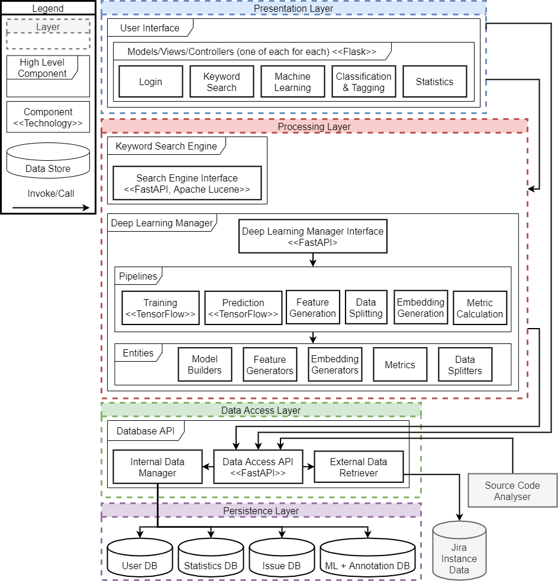

# Maestro Architecture -- Content

---

## High Level Architecture 

The image below gives an overview of the high level architecture of Maestro.
Maestro consists of six major components

1. **The user interface**
2. **The search engine API (Keyword Search Engine)**
3. **The deep learning manager**
4. **The database API**
5. **The database(s) powering Maestro** 
6. **A client-side library for interacting with the API (not pictured)**

### User Interface 

The user interface allows the user to interact with the system. 

Detailed architecture: [here](./ui.md)

### Search Engine API 

A centralised API which can perform keyword searches using Apache Lucene.

This component is centralised in order to allow indices to be computed 
once, after which they can be used by all users. 

Detailed architecture: [here](./search_engine.md)

### Deep Learning Manager 

The deep learning manager is the component which drives everything 
deep learning related in Maestro. It is responsible for 
model optimisation (hyperparameter optimisation), model training,
model evaluation, and computing predictions on novel issues.

Detailed architecture: [here](./dl_manager.md)

### Database API 

The database API provides access to the database. The database provides 
secure access through the use of JSON web tokens. Additionally, it separates 
the other backend components from having knowledge about the underlying 
database.

Detailed architecture: [here](./db_api.md)

### Database 

One or more database are used to store the actual data regaring issues, 
their annotation, deep learning, and statistics. Currently, we use MongoDB.

Detailed architecture: [here](./db_api.md)