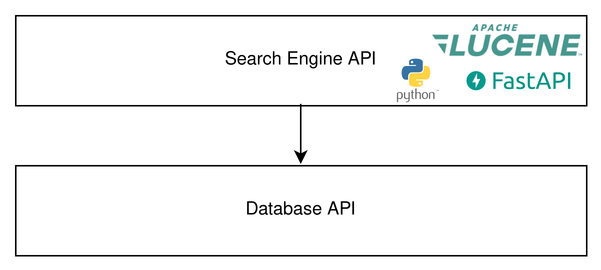

# Maestro -- Search Engine API Architecture

## High-level Architecture
The architecture of the search engine API is basically a simple wrapper around Apache Lucene. It enables users to create
search indexes and do search queries, all by means of simple API calls. Additionally, it makes calls to the issues
database API, in order to enhance the search results with predictions from a deep learning classifier. This enables
users to query issues that have a high potential to be rich in terms of software architecture knowledge.

*High level overview of the architecture. The search engine API is the main component, which makes use of Python, Apache
Lucene and FastAPI. It makes calls to the database API (also part of Maestro, which is covered separately) for enhancing
the search results with deep learning classifiers' predictions.*

### Search Engine API
The database API currently consists of two endpoints. One endpoint is used for creating search index and the other is
used for performing search queries. Documentation for this API is automatically generated by FastAPI, and can be found
at `https://{URL}:8042/docs`, where `{URL}` is the url to access the API (probably `localhost` when running it on a
local machine).

## Technology Stack
The technologies we used are listed below:
- Python is used to program the API
- PyLucene is used to interact with Apache Lucene from the Python API
- FastAPI is used for the API functionality
- Docker is used to run the search engine API
