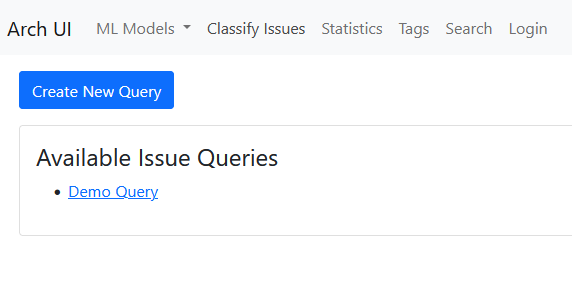
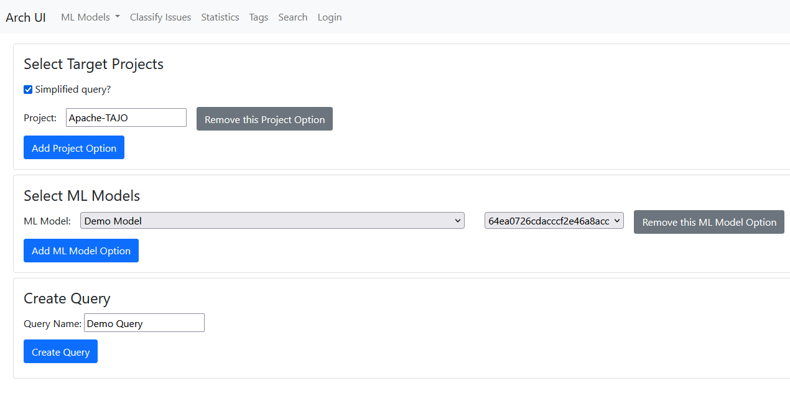
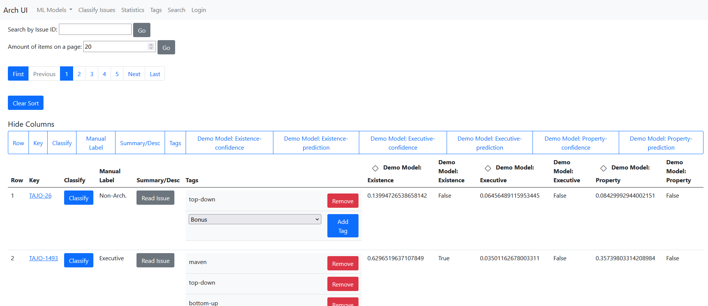
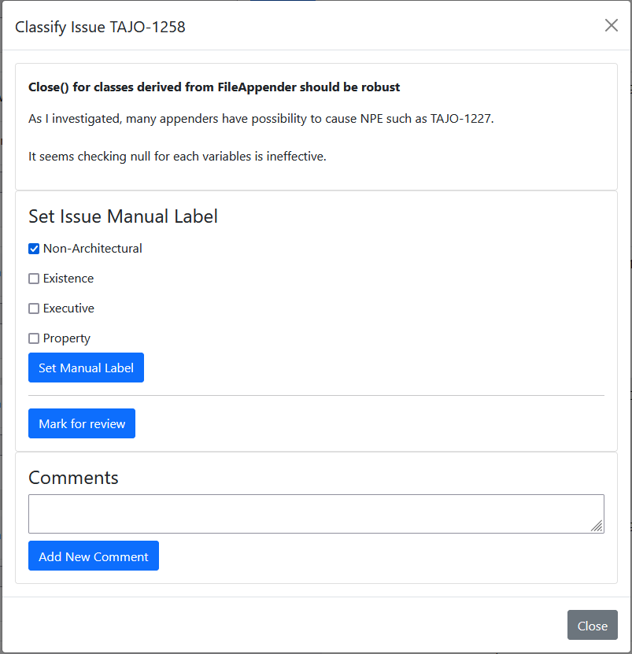
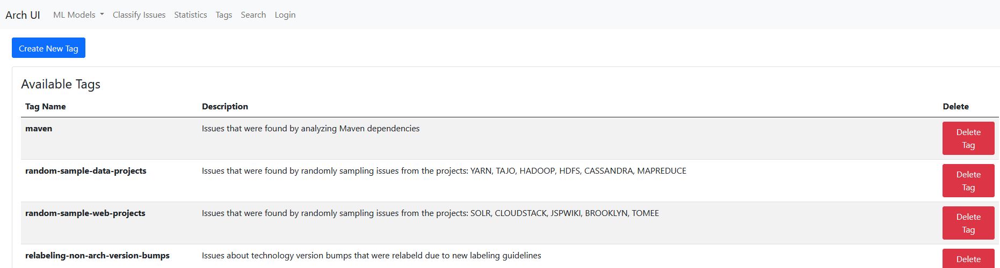
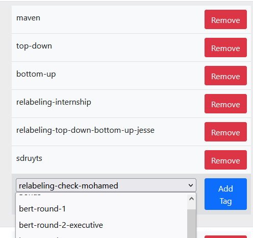

# ArchUI Usage Guide - Classification and Tagging

The component Classification and Tagging handles everything manual labels and cooperation related within ArchUI.

---

## Creating a Query

You can either create a query through the Predict interface (see the ML Models guide) or by creating one outright:

You land on this page by going to the Classify Issues tab in the nav bar:

In the Create New Query view, you can see the following:

Use the Add Project Option and Add ML Model Option buttons to add more of either. Use the relevant grey buttons on the specific model/project that you want to remove. It is possible to create a query without models, just so you can view the issues and manual labels themselves. Use the advanced query system to write a custom MongoSyntax query.

## Viewing a Query

Clicking on a query you will get an overview of all relevant information about all issues inside that query.

At the top of the page is searching by specific issue IDs and pagination controls. The Hide Columns row of buttons allows you to toggle columns to visible or invisible, controlling how much information is spread across your screen at once. In the big table is all the issue-specific information: the key acts as an external link to the issue if available, the Classify button brings up a menu with all action toggles other than the tags, which have their own column for easy display within the table itself. Beyond the tags, the classifier predictions sit.

## Manually Labeling

In the menu brought up by clicking an issue's Classify button, you can perform various actions. First, under Set Issue Manual Label, you can edit the label and then save it by clicking the Set Manual Label button. You can also toggle the issue to be in review or in the training dataset by clicking the "Mark for review/training" button. Issues that are in review will show up as yellow in the table, and will not be used to train models. Finally, you can add comments on the issue's manual label, for example to discuss a label with fellow researchers or as a way to note something.

## Tags

By clicking the `Tags` header in the navbar, you can have an overview of all tags in the database and manage them, including creating new ones.

Within the Classify overview of issues, you can add and remove tags to an issue:

