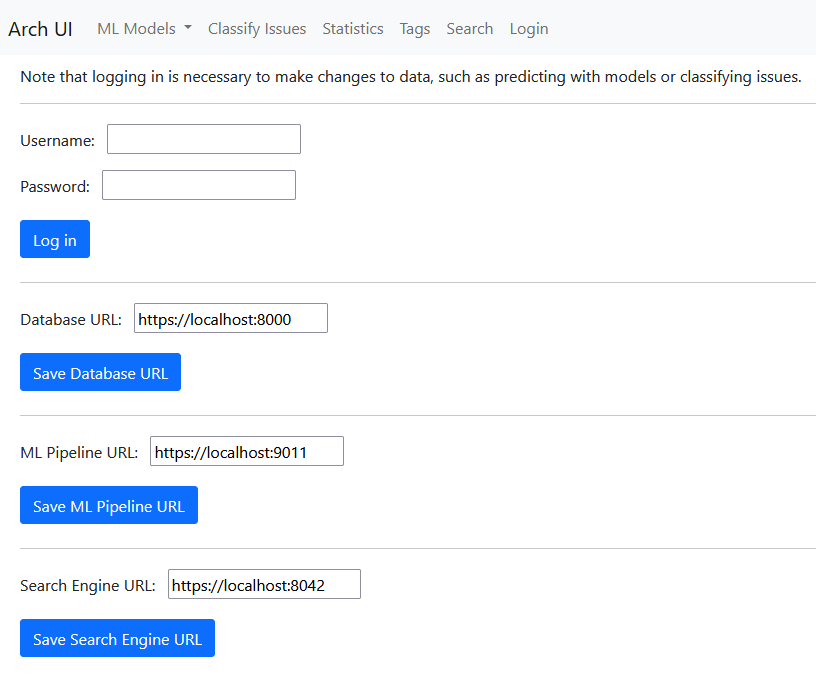
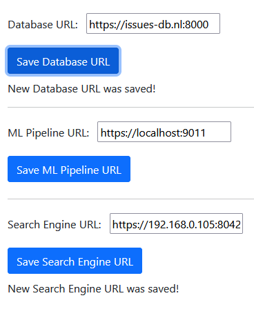
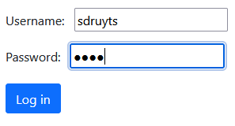
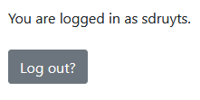

# ArchUI Usage Guide - Login

The Login component takes care of saving URLs to the external APIs and of the user's database account.

___

## Initial state

When a user first opens the UI, they should first set up their external connections. This is the initial view:

First, the user should make sure the three URLs are filled in and saved correctly. If the user is locally running services through Docker, they may have to fill in the local IP address of their machine instead of `localhost`. This IP address can be discovered through, for example, Windows' `ipconfig` commandline command.

## Logging In to the Database

Once the user has the correct database filled in and saved, they can log in to start working with the data.

How accounts are made varies based on who manages the database. If this is a local database, please refer to [the DB API's Users database section](../issues_db_api/README.md). In the UI, fill in your credentials and press `Log in`.

Upon successful login, the user will see this screen:

## Changing Databases after Logging In

After the user changes database URLs, they will need to log in again, as they cannot use one database's credentials on a different one.