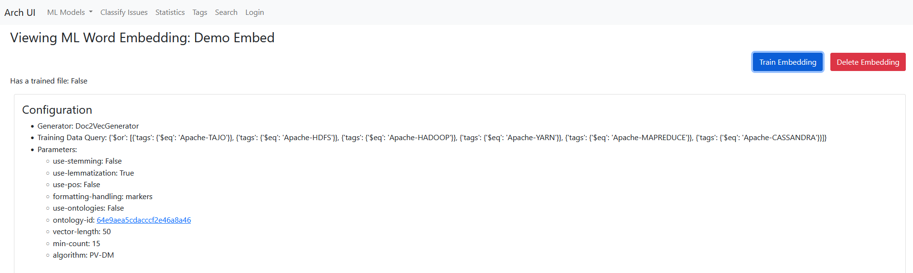

# ArchUI Usage Guide - Machine Learning Models

The Machine Learning Models (ML Models) component of the UI comprises the necessary features to curate and run ML models through the Maestro APIs in one place.

Usage of this component requires some surface knowledge about how ML Models work through Maestro, and how to set them up. This guide will run you through the process of creating your own models.

---

## Step 1: Ontologies

This step is optional, though if desired, must come first, because the word embedding and model configuration steps need to take it into account.

An ontology file is a `.json` file which can be used by some feature generators and classifiers. In the nav bar, navigate to the Ontologies page under the ML Models header:

The interface to upload a new ontology just requires you to select a file and type a name for it. The individual ontology view allows you to delete it.

## Step 2: Word Embedding

Word embeddings are used in several of the ML model's feature generator options, and must be separately created and trained to fit the specific feature generator they must be used in. As such, they are a separate component in the UI.

To access the word embeddings, click the `Word Embeddings` tab under the ML Models header in the navbar.

### Creating a new Word Embedding

The form to create a new embed has tooltips per field on hovering over them. The form automatically fills in all available defaults when opening the page. The screenshot is an example valid configuration. Note: you can select an ontology ID, but the embedding will not use it unless you tick the `use-ontologies` box.

After creating the config, you are taken to the page of the config you just created. There, you can train or delete it:

After selecting train, wait until the "Has a trained file" at the top of the embedding turns to say "True". Then, your embedding is trained.

## Step 3: Model Configuration

The biggest part of the ML Models component is the actual ML models themselves. View all models by heading to the third tab down the ML Models header in the navbar to access a list of all models currently available in your connected database.

### Creating a new Model Configuration

The `General` tab is your first stop, where you need to give your config a name and configure some basic things about it, like seed, output mode and model mode. Ensemble models can get really complicated, so this guide will stick to single mode.

The next thing to select is the `Classifier`. Here you will need to first select a classifier and then fill in all the relevant parameters. Default values already make up a functional model classifier.

The third step is the `Pre-Processing` tab. Depending on which classifier you selected, you will have different options available to select a pre-processor (named "Input Mode" in the form) from.

Finally, in the Training tab, there are various parameters still regarding the general training. A configuration that allows the model to train very fast for quick iteration:

Note: if you used a word embedding that selected to use ontologies, you must **also select to use ontology classes in this model configuration's training parameters**.

After you have verified that the model configuration is correct, save it, and you will be taken to the model configuration's view, where you can take various actions.

## Step 4: Training and Running Your Model

In order to evaluate and use your model, you first need to train it. Hit the train button and wait for the results to show up:

Now we can go to the fourth and final tab under the ML Models header in the navbar: Predicting with ML Models!

In this view, I choose to create a query immediately as well, so that I can immediately go see the results. For the guide to that, please see the Classification and Tagging guide document.

*Please not that at the time of writing, Detection is not supported in the query view, due to too little information. Please use Classification3 as output mode instead.*