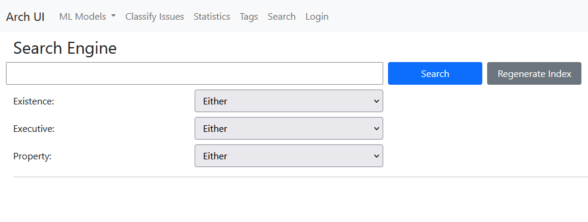

# ArchUI Usage Guide - Search

The Search component implements the Search engine API of Maestro.

---

The Search tab in the UI looks like this before it gets used:

In the text field, fill in your query. Then, if you are looking for specific design decisions, use the dropdowns per decision type. It is worth noting that the design decisions referred to here are the automatic labeling by a specific top-performing model, not manual labels. An example:

After clicking `Search`, you will get results for your query:

The issue headers are formatted like `<Ecosystem>: <Issue tag>`. Clicking on a header brings you to the issue view, where tags and description are collapsible. In this view, the manual label per issue is also displayed, if available. Example:

